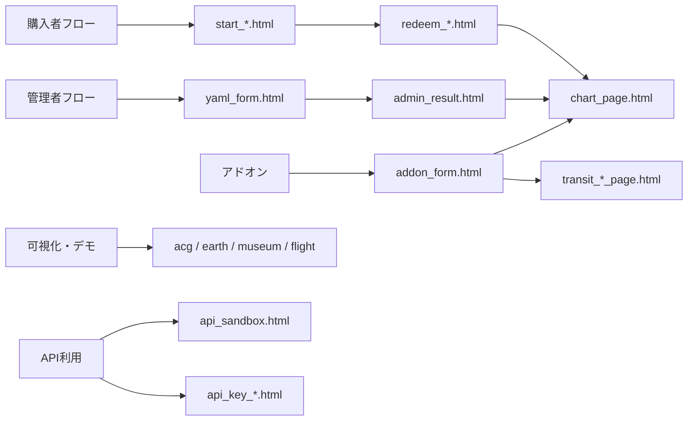

# templates 設計書

## 1. 目的

`templates/` にある Jinja2 テンプレートの役割、FastAPI ルートとの対応、受け取るデータ、画面遷移を整理する。

この文書は次の判断に使う。

- 画面を修正するとき、どのテンプレートとルートを触るか
- テンプレートへ渡すコンテキストの契約を確認する
- 購入者向け、管理者向け、デモ向けを区別する
- 現在ルートから使われていないファイルを判別する

実装の正本は `routes.py` と各テンプレートである。本書は 2026-07-18 時点の実装を記述する。

> 購入者向け画面の現行UI/UX、JA / EN / ES / DE、商品構成、受入テストは
> `docs/ui-ux/README.md` と同ディレクトリの機能別仕様書を正とする。
> 本書はテンプレート／ルート対応を調べるための技術資料であり、2026-07-18以降の
> 商品・言語仕様を上書きしない。

## 2. テンプレート基盤

### 2.1 初期化と配置

`routes.py` で以下のように初期化される。

```python
app.mount("/static", StaticFiles(directory="static"), name="static")
templates = Jinja2Templates(directory="templates")
```

テンプレートは `templates/*.html`、ブラウザへ直接配信する CSS・JavaScript・画像は原則 `static/` に置く。`templates/style.css` は静的配信対象ではなく、現行画面は `static/style.css` を参照している。

### 2.2 グローバル関数

全テンプレートから主に次を利用できる。

| 名前 | 用途 |
|---|---|
| `request` | `TemplateResponse` に必須。URL等の参照元 |
| `asset_url(path)` | `/static/...` に内容ハッシュの `?v=` を付ける |
| `asset_version` | 静的資産バージョンの表示・デバッグ用 |

静的資産はテンプレート内で直書きせず、原則 `{{ asset_url('style.css') }}` の形で参照する。

### 2.3 共通化方式

本プロジェクトは `` による共通レイアウトを採用していない。各HTMLが `<html>` からスクリプトまでを持つ独立ページである。

共通パーツは次の2つだけである。

| ファイル | 役割 | 利用元 |
|---|---|---|
| `_head_icons.html` | favicon、Apple Touch Icon 等の `<head>` 要素 | ほぼ全画面 |
| `_museum_demo.html` | Birth Chart Museum 無料デモ共通UI・言語切替・購入導線 | `house_tour.html`、`house_tour_architecture.html` |

このため、全画面共通の見た目を変える場合でも、HTML側の変更は複数ファイルに及ぶ可能性がある。共通スタイルは `static/style.css`、大型デモ固有のスタイルは各 `static/<feature>/` を優先する。

## 3. 画面領域



## 4. 購入者フロー

### 4.1 商品とテンプレートの動的対応

`/start` と `/redeem` は `_buyer_template(prefix, product_type)` でテンプレート名を決める。コード検索でファイル名がルート付近に現れないのはこのためである。

| 商品種別 | slug | 注意事項 | 入力フォーム |
|---|---|---|---|
| `western_basic` | `western-basic` | `start_western_basic.html` | `redeem_western_basic.html` |
| `western_full` | `western-full` | `start_western_full.html` | `redeem_western_full.html` |
| `western_asteroids_addon` | 商品設定による | `start_western_basic.html` | `redeem_western_basic.html` |
| `shichu` | `shichu` | `start_shichu.html` | `redeem_shichu.html` |
| `transit_yaml` | `transit-yaml` | `start_transit_yaml.html` | `redeem_transit_yaml.html` |

共通コンテキスト:

| キー | 内容 |
|---|---|
| `lang` | `ja` / `en` / `es` / `de`。通常画面の未指定は `ja` |
| `t` | `routes.py` の `I18N[lang]` |
| `lang_urls` | 現在URLの日本語・英語切替先 |
| `product_type` | 内部商品種別 |
| `product` | ローカライズ済みの商品名、説明、機能一覧、計算オプション |
| `start_url` / `redeem_url` | 商品別の正規URL |

### 4.2 注意事項画面

- `GET /start`
- `GET /start/{product_slug}`
- `?lang=ja|en` で言語切替
- CTAから対応する `/redeem/{product_slug}` へ遷移

`start.html` は旧来の汎用版であり、現行の `_buyer_template()` からは選ばれない。

### 4.3 入力・引換画面

- `GET /redeem[/<product_slug>]` で初期表示
- `POST /redeem[/<product_slug>]` で注文検証、計算、DB保存
- 成功時は `303 /chart/{token}`
- 失敗時は同じテンプレートへ `error` と入力済み `form` を返す

追加コンテキスト:

| キー | 内容 |
|---|---|
| `prefectures` | 国内都道府県一覧 |
| `timezone_options` | 海外出生地用タイムゾーン一覧 |
| `payhip_products` | Payhip 商品選択肢 |
| `error` | 検証・注文・計算・保存エラー。正常時は `None` |
| `form` | 再表示用の入力値 |

西洋占星術フォームは国内・海外出生地、座標、出生時刻精度、確認モーダルを持つ。`redeem_western_basic.html` と `redeem_western_full.html` はほぼ同型だが別ファイルなので、一方を直した場合は他方への反映要否を必ず確認する。

四柱推命フォームだけは日替わり境界（23時/1時）を入力できる。トランジットYAMLは出生情報ではなく、出来事名・日時・場所・暦を入力する。

### 4.4 結果画面

`chart_page.html` は購入者向けの中心画面である。

- `GET /chart/{token}`
- 商品種別とYAML内容から表示機能を動的判定
- YAML、AIプロンプト、SVG、ZIP、各分割YAMLへの導線を表示
- 日本語・英語切替対応
- チャートの期限と公開キャッシュヘッダーを適用

主要コンテキスト:

| 分類 | キー |
|---|---|
| 本体 | `token`, `chart`, `chart_url`, `expires_at`, `expires_label`, `chart_has_no_expiry` |
| YAML | `share_yaml_text`, `asteroid_yaml_text`, `yaml_url`, `natal_yaml_url`, `natal_asteroids_yaml_url`, `transit_yaml_url`, `long_term_transits_yaml_url`, `detail_yaml_url` |
| プロンプト | `share_prompt_text`, `chart_companion_prompt`, `prompt_url` |
| 画像・DL | `horoscope_svg_url`, `shichusuimei_svg_url`, `download_zip_url` |
| 表示条件 | `is_transit_yaml`, `has_31day_transit`, `has_western_asteroids`, `has_long_term_transits`, `has_yaml_mode_selector`, `has_horoscope_svg`, `has_shichusuimei_svg`, `has_asteroid_svg_data` |
| 外部導線 | `usage_guide_url`, `birth_time_reissue_url`, `hoshiyomi_app_url`, `transit_flight_url`, `next_transit_url` |

このテンプレートは条件分岐が多く、変更時の影響範囲が最も大きい。最低でも `western_basic`、`western_full`、`shichu`、`transit_yaml` の4種類で表示確認する。

## 5. 管理者・運用画面

| テンプレート | ルート | 役割 | 主なコンテキスト/送信先 |
|---|---|---|---|
| `index.html` | `GET /` | 管理・デモ入口 | `admin_test_site_path` |
| `test_site.html` | 秘匿管理URL | API/表示のテストハブ | `request` |
| `yaml_form.html` | `GET /admin/yaml/new` | 任意チャート生成 | `prefectures`, `form`, `error`; POST `/admin/yaml/generate` |
| `admin_result.html` | `GET /admin/yaml/result/{token}` | 発行URL・YAML・プロンプト確認 | `chart`, `chart_url`, `yaml_url`, `prompt_url`, `expires_label` |
| `post_chart_form.html` | `GET /admin/post-chart/new` | 企業・出来事チャート作成 | `prefectures`, `default_date`, `default_time`, `form`, `error` |
| `post_chart_result.html` | POST生成後 | 投稿用チャート生成結果 | `result` |
| `post_chart_bulk_form.html` | `GET/POST /admin/post-chart/bulk-new` | CSV相当の一括発行 | `bulk_input`, `rows`, `csv_output` |
| `admin_personal_edition_codes.html` | `GET/POST /admin/personal-edition/codes` | Personal Editionコード発行 | `codes`, `form`, `error` |
| `mundane_form.html` | `MUNDANE_ADMIN_PREFIX/...` | マンデン記事作成・編集 | `form`, `post`, `error`, `saved`, `statuses`; YAML生成APIも使用 |
| `mundane_page.html` | `GET /mundane/{slug}` | 公開マンデン記事 | `post`, `public_url`, `chart_svg`, `chart_aspects`, `chart_svg_url`, `body_html` |

管理画面の一部は Basic Auth または環境変数由来の秘匿パスで保護される。テンプレート自体に認可責務はなく、必ずルート側で認証する。

## 6. API・キー発行

| テンプレート | ルート | 役割 |
|---|---|---|
| `api_sandbox.html` | `GET /api-sandbox` | デモ計算APIをブラウザから試す |
| `nanami_api_spec.html` | `GET /manual/api` | API仕様書 |
| `api_key_start.html` | `GET /api-key/start`, エラー時POST再表示 | 注文番号からAPIキーを発行 |
| `api_key_result.html` | `POST /api-key/redeem` 成功・重複時 | APIキーの一度限り表示、発行済み情報表示 |

`api_key_result.html` の `api_key` は新規発行時だけ値が入り、`already_issued=True` では秘密値を再表示しない。

`api_manual.html` は現行ルートから参照されず、実際の `/manual/api` は `nanami_api_spec.html` を使う。

## 7. アドオン・期間限定配布

| テンプレート | ルート | 役割 |
|---|---|---|
| `addon_form.html` | `GET /addon/new`, `GET /admin/addon/new`, 各POST再表示 | 小惑星、31日トランジット、長期トランジット等の生成 |
| `transit_addon_page.html` | `GET /addon/transit/{token}` | 生成済みトランジットYAML表示・DL |
| `long_term_transits_addon_page.html` | `GET /addon/long-term-transits/{token}` | 長期トランジットYAML表示・DL |
| `note_transit.html` | `GET /note-transit/{access_key}` | キャンペーン単位の月間トランジット生成 |

`addon_form.html` は `addon_type` に応じ、通常チャートへ統合して `/chart/{token}` へ進むケースと、専用YAMLページを発行するケースがある。`expired=True` の専用ページはHTTP 410で返る。

## 8. Personal Edition

`personal_edition_activate.html` は `GET/POST /personal-edition/activate` で使用する。引換コードと出生情報を受け、Personal Edition成果物を発行する。

主要コンテキストは `lang`, `t`, `lang_urls`, `error`, `form`, `prefectures`, `timezone_options`。個人情報を扱うためレスポンスは `Cache-Control: no-store` とする。

## 9. 可視化・体験デモ

| テンプレート | URL | データ源・特徴 |
|---|---|---|
| `acg_map.html` | `/acg` | `/api/acg/mundane`, `/api/acg/personal`; Leaflet/Turf; JA / EN / ES / DE対応 |
| `acg_globe_demo.html` | `/acg/globe-demo` | 3D ACG仕組みデモ |
| `astro_earth.html` | `/astro-earth` | `/api/acg/personal`, `/api/astro-earth/point`; 3D地球儀 |
| `transit_flight.html` | `/transit-flight` | 固定サンプルまたはYAML/URL変換API |
| `birth_chart_museum.html` | `/birth-chart-museum` | 2種類のMuseumへの入口 |
| `house_tour.html` | `/house-tour`, `/birth-chart-museum/demo` | 抽象版3D Museum |
| `house_tour_architecture.html` | `/house-tour-architecture`, `/birth-chart-museum/demo/architecture` | 建築版3D Museum |
| `travel_form.html` | `/travel` | 出生図YAMLと旅行先を入力、地図で座標選択 |
| `travel_result.html` | `/travel/result/{token}` | 旅行診断、YAML・プロンプト共有 |

大型デモはHTML内のCSS/JS量も多い。変更時は対応する `static/<feature>/` の資産とAPIルートをセットで確認する。

Museumの無料デモルートだけは `_museum_demo_context()` から `is_demo`, `shop_url_en`, `shop_url_ja` を受ける。通常の `/house-tour*` は `request` のみで動作する。

## 10. ルート未接続・補助ファイル

2026-07-18 時点で `routes.py` の `TemplateResponse` または動的テンプレート選択から参照されないファイル:

| ファイル | 状態 |
|---|---|
| `start.html` | 商品別テンプレート導入前の汎用版と考えられる |
| `redeem.html` | 商品別テンプレート導入前の汎用版と考えられる |
| `api_manual.html` | `/manual/api` は `nanami_api_spec.html` を使用 |
| `guide_portal.html` | FastAPIルートなし |
| `guide_shichu.html` | FastAPIルートなし |
| `guide_vedic.html` | FastAPIルートなし |
| `legal.html` | FastAPIルートなし |

補助ファイル:

| ファイル | 状態 |
|---|---|
| `_head_icons.html` | include専用。単独ルート不要 |
| `_museum_demo.html` | include専用。単独ルート不要 |
| `style.css` | `templates/` にあるが現行の `/static` からは配信されない |

未接続ファイルは即削除対象とは限らない。外部ビルドや手動コピーの有無を確認してから、削除・移動・ルート追加を判断する。

## 11. データとセキュリティ境界

### エスケープ

通常の `{{ value }}` はJinja2の自動エスケープに任せる。HTMLとして出す値は生成元を限定する。

- `mundane_page.html` の `body_html` はサーバー側 `_render_simple_markdown()` の出力
- `|safe` を追加するときは、ユーザー入力が混ざらないことを確認する
- JavaScriptへ値を渡す場合は文字列連結せず `|tojson` を使う

### キャッシュ

- 個人情報入力、コード発行、エラー再表示は `_mark_no_store()` を使う
- 公開チャートは `_apply_public_chart_headers()` で期限に応じたヘッダーを付与する
- テンプレートを追加するとき、画面の性質に応じてルート側で明示する

### 認証

Jinja2は表示層であり、管理者認証やトークン期限の判定をテンプレートへ移さない。ルートで拒否または404/410を決め、テンプレートには表示状態だけを渡す。

## 12. 変更手順

### 既存画面を変更する

1. 本書の一覧からURL、テンプレート、対応ルートを特定する。
2. `TemplateResponse` のコンテキストとテンプレート内の参照キーを照合する。
3. POSTフォームなら `name` とFastAPIの `Form(...)` 引数を同時に確認する。
4. 静的資産は `static/` に置き、`asset_url()` で参照する。
5. エラー再表示で入力値が保持されることを確認する。
6. 多言語対応画面はJA / EN / ES / DEを確認する。
7. 商品別画面は類似テンプレートへの反映要否を確認する。

### 新しい画面を追加する

1. `templates/<name>.html` を作る。
2. `routes.py` に明示的なGETルートを追加する。
3. フォームがあればPOSTルートと失敗時の再描画契約を決める。
4. `request` を含むコンテキストを渡す。
5. `_head_icons.html` と必要なCSSを読み込む。
6. 公開、管理者限定、トークン限定のどれかを決める。
7. キャッシュ方針とエラー時HTTPステータスを決める。
8. 本書の対応表へ追記する。

## 13. 今後の整理方針

現状を安全に整理するなら、次の順序が望ましい。

1. 未接続ファイルの利用実態を確認し、`templates/legacy/` への移動または削除を決める。
2. `templates/style.css` が不要なら削除し、CSSの正本を `static/style.css` に一本化する。
3. `start_*` と `redeem_western_*` の重複を、Jinja includeまたはmacroで段階的に共通化する。
4. 新規画面から共通レイアウトを導入し、既存大型デモは無理に一括移行しない。
5. テンプレートごとの最低限のレンダリングテストを追加する。

共通化では見た目が似ていることより、受け取るコンテキストと操作フローが同じであることを基準にする。特に大型3Dデモと購入者フォームは責務が異なるため、同じ基底レイアウトへ急いで統合しない。
